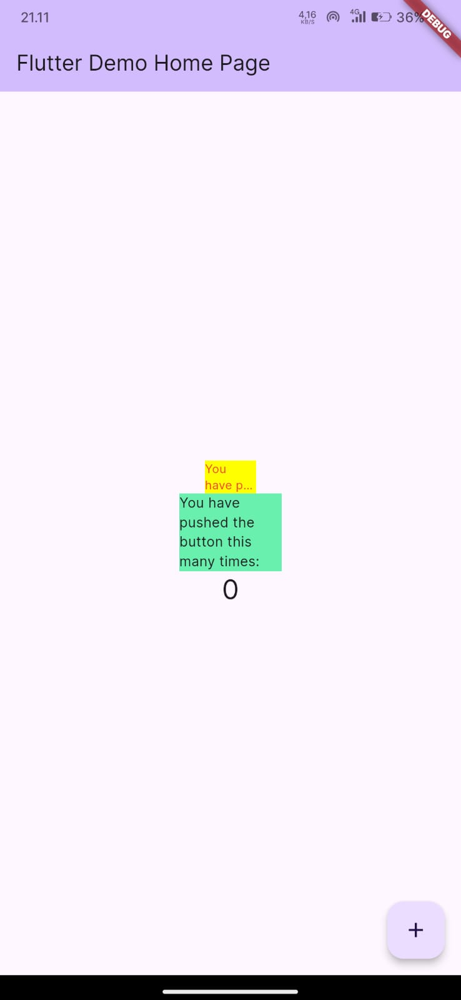

# Nama  : Lukman Eka Septiawan
# Kelas : TI-3C

## Praktikum Penerapan Plugin 
### Langkah 1 - Buat Project Baru
> Membuat project baru dengan nama flutter_plugin_pubdev, lalu membuat repository baru dengan nama flutter_plugin_pubdev https://github.com/Lukman289/flutter_plugin_pubdev.git

### Langkah 2 - Menambahkan Plugin

> Penjelasan: melakukan penambahan plugin pada project melalui terminal.

### Langkah 3 - Buat File red_text_widget.dart
```dart
import 'package:flutter/material.dart';

class RedTextWidget extends StatelessWidget {
  const RedTextWidget({Key? key}) : super(key: key);

  @override
  Widget build(BuildContext context) {
    return Container();
  }
}
```
> Penjelasan: membuat file widget baru dengan nama red_text_widget.dart

### Langkah 4 - Tambah Widget Auto Size
```dart
Widget build(BuildContext context) {
    return AutoSizeText(
      text,
      style: const TextStyle(color: Colors.red, fontSize: 14),
      maxLines: 2,
      overflow: TextOverflow.ellipsis,
    );
  }
```
> Penjelasan: merubah file red_text_widget untuk menambahkan plugin auto_text_widget

### Langkah 5 - Buat Variabel Text dan Parameter di Constructor
```dart
class RedTextWidget extends StatelessWidget {
  final String text;
  const RedTextWidget({Key? key, required this.text}) : super(key: key);

  @override
  Widget build(BuildContext context) {
    return AutoSizeText(
      text,
      style: const TextStyle(color: Colors.red, fontSize: 14),
      maxLines: 2,
      overflow: TextOverflow.ellipsis,
    );
  }
}
```
> Penjelasan: menambahkan variabel texk dan penambahan parameter pada constructor untuk memberikan nilai pada parameter text yang akan ditampilkan.

### Langkah 6 - Tambahkan Widget di main.dart
```dart
return Scaffold(
      appBar: AppBar(
        backgroundColor: Theme.of(context).colorScheme.inversePrimary,
        title: Text(widget.title),
      ),
      body: Center(
        child: Column(
          mainAxisAlignment: MainAxisAlignment.center,
          children: <Widget>[
            Container(
              color: Colors.yellowAccent,
              width: 50,
              child: const RedTextWidget(
                text: 'You have pushed the button this many times:'
              ),
            ),
            Container(
              color: Colors.greenAccent,
              width: 100,
              child: const Text(
                'You have pushed the button this many times:'
              ),
            ),
            Text(
              '$_counter',
              style: Theme.of(context).textTheme.headlineMedium,
            ),
          ],
        ),
      ),
      floatingActionButton: FloatingActionButton(
        onPressed: _incrementCounter,
        tooltip: 'Increment',
        child: const Icon(Icons.add),
      ), // This trailing comma makes auto-formatting nicer for build methods.
    );
```
> Penjelasan: menambahkan Container pada children dengan menggunakan widget red_text_widget dan menggunakan Text biasa.

### Screenshoot dari smartphone


### Tugas Praktikum
1. Selesaikan Praktikum tersebut, lalu dokumentasikan dan push ke repository Anda berupa screenshot hasil pekerjaan beserta penjelasannya di file README.md!

2. Jelaskan maksud dari langkah 2 pada praktikum tersebut!
> Jawaban: Pada langkah ini perintah tersebut digunakan untuk menambahkan plugin auto_text_widget ke dalam project flutter.

3. Jelaskan maksud dari langkah 5 pada praktikum tersebut!
> Jawaban: Penambahan variabel text digunakan untuk menampung data dari constructor, yang nantinya akan ditampilkan pada widget.

4. Pada langkah 6 terdapat dua widget yang ditambahkan, jelaskan fungsi dan perbedaannya!
> Jawaban: Pada container pertama menggunakan RedTextWidget, dimana widget tersebut adalah class widget yang telah kita buat sebelumnya dengan memanfaatkan plugin auto_size_text. Sedangkan untuk container kedua menggunakan widget Text seperti biasa.

> Perbedaan yang dapat dilihat adalah container pertama hanya menampilkan 2 baris text saja, sedangkan untuk container kedua menampilkan semua text dan tidak memperdulikan berapa banyak baris yang digunakan. Hal tersebut bisa terjadi karena pada widget RedTextWidget menggunakan parameter maxLines.

5. Jelaskan maksud dari tiap parameter yang ada di dalam plugin auto_size_text berdasarkan tautan pada dokumentasi ini !
> pada plugin auto_size_text terdapat 18 parameter yang dapat digunakan, antara lain:
> - key: kunci unik untuk mengidentifikasi widget.
> - textKey: parameter ini digunakan untuk menampilkan teks
> - style: parameter ini menentukan style dari teks yang akan ditampilkan, seperti ukuran, warna, ketebalan teks, dll.
> - minFontSize: parameter ini digunakan untuk menentukan batas minimal ukuran huruf atau text yang akan ditampilkan.
> - maxFontSize: parameter ini digunakan untuk menentukan batas maksimal ukuran huruf atau text yang akan ditampilkan.
> - stepGranularity: menentukan seberapa besar perubahan ukuran font ketika teks secara otomatis diubah ukurannya.
> - presetFontSizes: menentukan daftar ukuran font yang telah ditentukan
> - group: parameter ini memungkinkan beberapa widget yang telah dibuat sebelumnya untuk berbagi ukuran font yang sama dalam grup.
> - textAlign: mengatur perataan teks, seperti kiri, kanan, tengah, atau justify.
> - textDirection: menentukan arah teks, misalnya apakah teks harus dirender dari kiri ke kanan atau sebaliknya.
> - locale: mengatur teks yang bisa mempengaruhi seperti apa teks itu ditampilkan, misalnya pengaturan untuk angka atau huruf khusus dalam bahasa tertentu.
> - softWrap: menentukan apakah teks harus membungkus secara otomatis pada batas ruang atau tidak.
> - wrapWords: menentukan apakah teks harus dibungkus pada batas kata atau tidak.
> - overflow: parameter ini digunakan untuk menentukan bagaimana tampilan jika text mengalami overflow.
> - overflowReplacement: menentukan widget alternatif yang akan ditampilkan jika teks tidak muat dalam batasan ruang yang diberikan.
> - textScaleFactor: parameter ini menentukan faktor skala dari teks yang ditampilkan.
> - maxLines: parameter ini digunakan untuk membatasi jumlah line/baris yang digunakan
> - semanticsLabel: parameter ini digunakan untuk fitur aksesibilitas, yaitu teks alternatif yang akan dibacakan oleh system.

6. Kumpulkan laporan praktikum Anda berupa link repository GitHub kepada dosen!

<div align="left">
  <a href="https://github.com/Lukman289/flutter_plugin_pubdev.git">
   https://github.com/Lukman289/flutter_plugin_pubdev.git </a>
</div>
