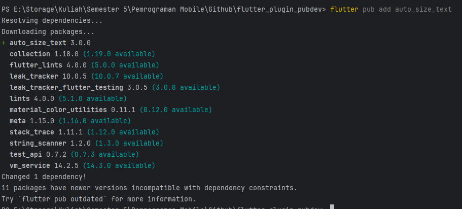

# Nama  : Lukman Eka Septiawan
# Kelas : TI-3C

## Praktikum Penerapan Plugin 
### Langkah 1 - Buat Project Baru
> Membuat project baru dengan nama flutter_plugin_pubdev
### Langkah 2 - Menambahkan Plugin

### Langkah 3 - Buat File red_text_widget.dart
### Langkah 4 - Tambah Widget Auto Size
### Langkah 5 - Buat Variabel Text dan Parameter di Constructor
### Langkah 6 - Tambahkan Widget di main.dart
